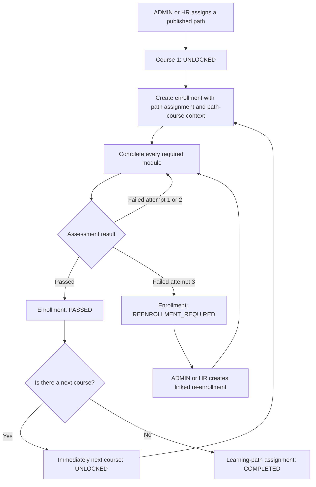

# Learning-path route and state model

This document is the submission diagram for the sequential corporate learning-route rule.

## Course-state derivation

For an active path assignment, courses are ordered by `sequenceNumber` and returned as:

| State         | Exact rule                                                                                                         |
| ------------- | ------------------------------------------------------------------------------------------------------------------ |
| `PASSED`      | The employee has any historical `PASSED` enrollment for the course. Certificate expiry does not remove the pass.   |
| `IN_PROGRESS` | No historical pass exists and the employee has an `ENROLLED`, `IN_PROGRESS`, or `READY_FOR_ASSESSMENT` enrollment. |
| `UNLOCKED`    | It is the first course, or the immediately previous ordered course has a historical pass.                          |
| `LOCKED`      | It is not the first course and the immediately previous ordered course has no historical pass.                     |

The enrollment stores both `learningPathEnrollmentId` and `learningPathCourseId`; both are null for a direct enrollment or both are present for a path enrollment. This prevents ambiguity when one course appears in multiple paths.

## Invariants

- Only published courses can be added to a path.
- A path must contain at least one course before publication.
- `(learningPathId, courseId)` and `(learningPathId, sequenceNumber)` are unique.
- An employee can be assigned to a path once in the MVP.
- Path structure is immutable after its first assignment.
- Path enrollment always calls the normal enrollment service; it cannot bypass active-employee, published-course, duplicate-active-enrollment, progress initialization, or transaction rules.
- Only `ADMIN` and `HR_MANAGER` can assign paths or enroll an employee in an unlocked path course.
- An employee can view only their own path assignments and derived progress.
- Passing the last outstanding path course updates the assignment to `COMPLETED` in the same transaction as the attempt, enrollment pass, and certificate.

## Primary API sequence

1. `POST /api/v1/learning-paths`
2. `POST /api/v1/learning-paths/{learningPathId}/courses` for each ordered course
3. `POST /api/v1/learning-paths/{learningPathId}/publish`
4. `POST /api/v1/learning-path-enrollments`
5. `GET /api/v1/learning-path-enrollments/{pathEnrollmentId}` to inspect derived states
6. `POST /api/v1/learning-path-enrollments/{pathEnrollmentId}/courses/{courseId}/enroll`
7. Complete modules and submit the assessment through the standard enrollment endpoints

Trying step 6 for a locked course returns HTTP `409` with code `LEARNING_PATH_PREREQUISITE_NOT_PASSED` and the safe `previousCourseId` detail.
